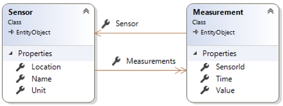
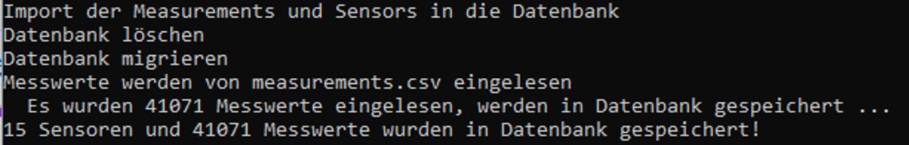
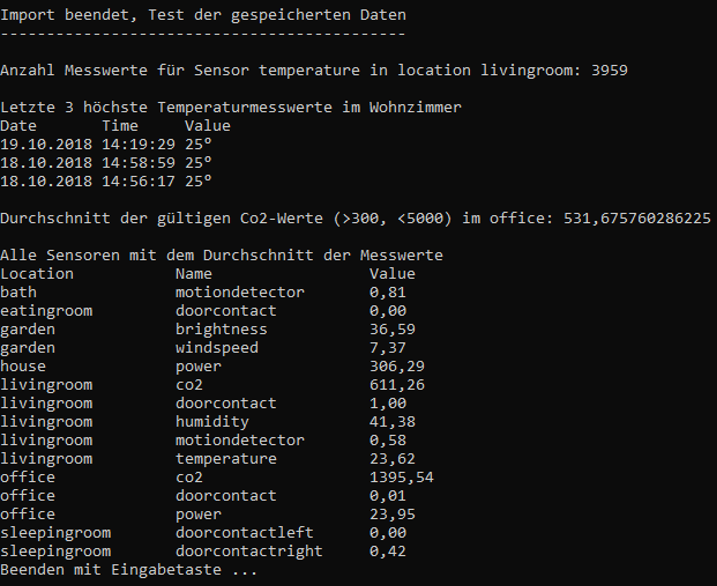

# SmartSchool (EF + UoW)

## Lehrziele

* Entity Framework Core 
* LINQ
* Muster: Repository und UnitOfWork

Es sind die Messwerte verschiedener Sensoren aus einer csv-Datei einzulesen und zu analysieren. 

## Core

Die Klasse `Sensor` verwaltet den Namen, den Standort und die Einheit der Messwerte. Die Messungen geben über die Werte zu bestimmten Zeitpunkten Auskunft. Die Entities sind, bis auf etwaige Annotationen bereits angelegt.

Im Corelayer sind die Contracts für die Repositories bedarfsgerecht anzulegen.

## ImportController

Die einzelnen Zeilen der csv-Datei sind so zu verdichten, dass am Schluss eine Collection von `Measurements` mit ihren Sensoren zurückgegeben wird.

## Persistence

Die Migration wird, über die `NuGet Package Manager`-Konsole erstellt/angewendet: 
1.	Persistence als "Startup Project" 
1.	`Add-Migration "InitialMigration"`
1.	`Update-Database` mit Kontrolle, ob DB angelegt wurde
1.	Die Daten über die ImportConsole importieren.

Die Repositories müssen noch um die benötigten Methoden erweitert werden.

## Console (SmartSchool.TestConsole)

Die Konsolenanwendung testet den Import und setzt einige Abfragen ab.

Aufgaben:

* Importieren der Daten per ImportController
   * Persistieren der Daten in die Datenbank 
* Analyse der Daten in der Datenbank entsprechend dem nachfolgenden Screenshot
   * Es sollen möglichst wenige Daten aus der Datenbank geladen werden.
* Abfragen
   * Anzahl der Messwerte für Location: livingroom und Sensor: temperature
   * Drei höchste Temperaturwerte im Livingroom
      * Sortierung bei gleichem Wert nach Datum (absteigend)
   * Durchschnitt der CO2-Werte im Büro
      * Messwerte <=300 und >=5000 werden nicht berücksichtigt
   * Sensoren mit dem Mittelwert ihrer Messwerte

